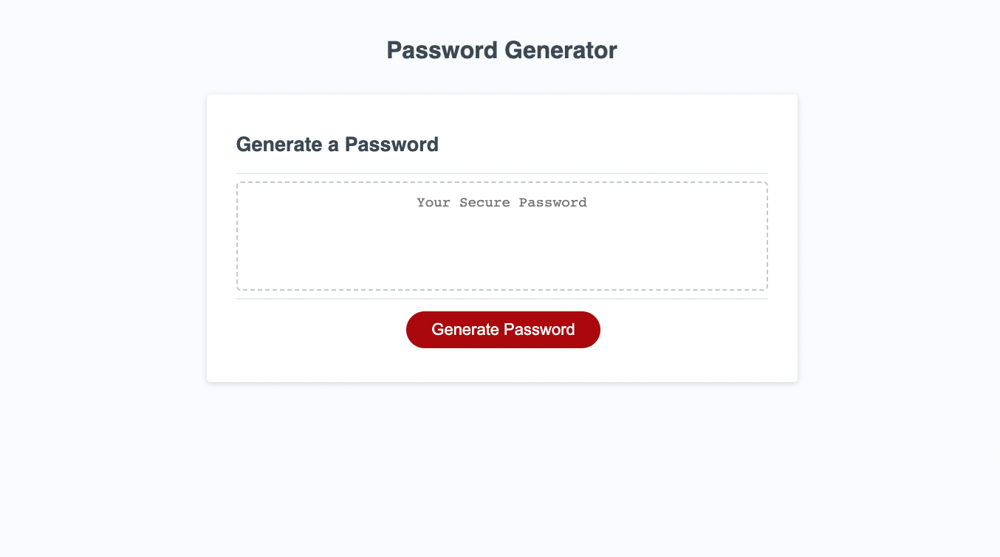

# homework-03-password-generator
Javascript Challenge: Password Generator

GitHub: https://github.com/minutemin/homework-03-password-generator

GitPages:   https://minutemin.github.io/homework-03-password-generator/

## Description ##

Javascript Challenge: Password Generator

In this challenge, we were asked to finish a javascript code that would generate a random password based off of user's choice of how many characters to be involved with the password, and if they want upper case letters, lower case letters, numbers and special characters to be included in their generated password.  The generated password should then display in the password box after hitting the generate password button on the webpage.

## Usage

When they click on the "Generate Password" button, a promp window will appear asking how many characters should be in the password.  The user must pick a number between 8 - 128. After picking the quantity, they are giving other confirm windows if they want the upper or lower case letters, numbers or special characters. They must pick at least one of these options in order to get a password, if they deny all, then a prompt window will appear letting them know they need to pick at least one type of character.  

When selecting all of the user's options, the generator will randomly pick characters out of the options until the amount of characters are filled for the preferred length of the password.  Then it will display in the password box that is in the HTML/CSS.

## What I did:

Following the demonstration, in javascript, I added the type of characters the generator would be picking from randomly. This consists of uppercase and lowercase letters, numbers and special characters. We establish a new object called "password characters" as an empty array. Then I added "if statements" for each of the types if characters the password characters would get picked from.  Split command is added after concating the group of character type to passwordCharacter so that the type of characters in each string can break up into it's own array, for the passwordCharacters object. I then I created an if statement for each of the types of character so within those statements the passwordCharacter can add to. Cleaned up and double checked my code, plus ran it with various options to see if there were any bugs.  

## Credits

Instructor Samantha Randolph gave us a demo to get us started and had us finish the code, so there is some credit that goes to her.  The assignment started off with the document query to the generate ID, and also gave us the function for the end to have the results of the generator displayed to the html password box plus the event listener for the write password. She then started to write the generatepassword function, showed us how to write the window prompts and gave one example of the for if statements and identifying the special characters and left the rest of us to finish it.  She also showed us how to write the for loop and math codes.  

## License

Licensed under the MIT license.